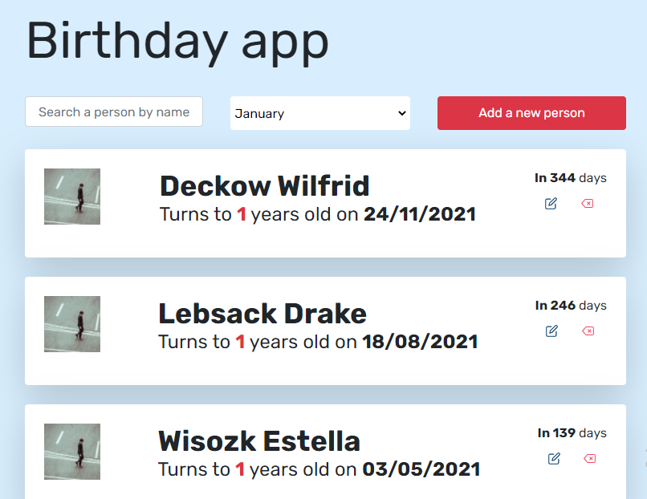

<h1 align="center">Birthday app</h1>

<div align="center">
  <h3>
    <a href="https://fanilo-birthday-app.netlify.app/">
      Demo
    </a>
  </h3>
</div>

<!-- OVERVIEW -->

## Screenshot



You can see my demo by clicking this [link](https://fanilo-birthday-app.netlify.app/)

### Built With

-   [Vanilla](https://developer.mozilla.org/en-US/docs/Web/JavaScript)

### Figma design
[https://www.figma.com/file/LEUZKSMUfcf8twluAqmiqC/Birthday-App-Copy](https://www.figma.com/file/LEUZKSMUfcf8twluAqmiqC/Birthday-App-Copy)

## Features

- Using Custom-hooks
- Searching a person by their name or month of their birthday.
- Adding a new person to the list
- Removing a person
- Editing a preson

### The most challenging parts in this project are: 
 - Working with the date.
 - Sorting those people by the soonest birthday.

## How To Use

<!-- Example: -->

To clone and run this application, you'll need [Git](https://git-scm.com) and [Node.js](https://nodejs.org/en/download/) (which comes with [npm](http://npmjs.com)) installed on your computer. From your command line:

```bash
# Clone this repository
$ git clone https://github.com/lightme-fan/birthday-app

# Install dependencies
$ npm install
$ npm install date-fns

# Run the app
$ parcel index.html
```

## Contact

-   Website [Bithday App](https://fanilo-birthday-app.netlify.app/)
-   GitHub [lightme-fan](https://{github.com/lightme-fan})
